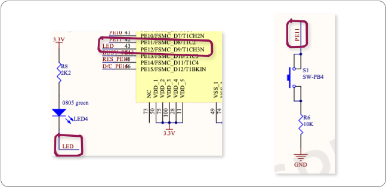
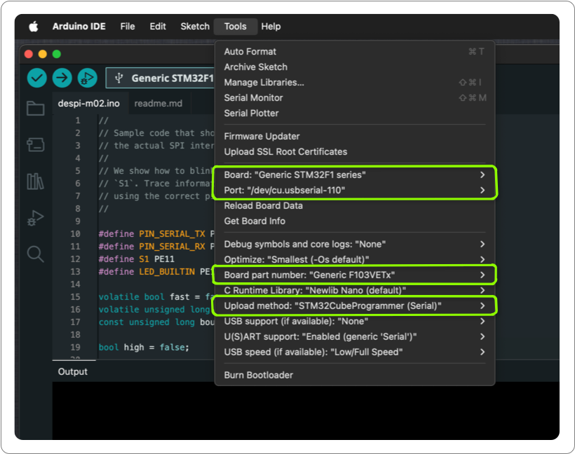
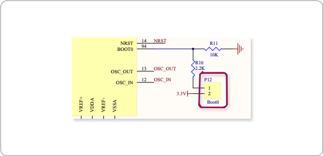

# Flashing an Arduino Sketch to the DESPI-M02

Here are instructions to flash an Arduino sketch the DESPI-M02. I wrote these
because I had trouble finding a comprehensive programming guide for that board.
My DESPI-M02s came with the e-paper samples I bought, so I might as well make
good use of them.

In this howto, I try to show not only the code, but also explain how to use the
board schematic to be able to find details that are important to programming.
We'll see how on-board peripherals are wired and how you can determine which pin
numbers to use to control them. The schematic also shows other details, such as
whether a pin is active-low or if a pin needs a pull-up or pull-down resistor.
All these will save you time and headaches when you are programming for a board.

I use Mac OS X and the examples and screenshots are from my Mac system. If you
use Linux or something else, please adjust the commands accordingly.

In this example, I show you three ways to flash your program to the STM32 board:
use the Arduino IDE with the
[STM32 Cube Programmer](https://www.st.com/en/development-tools/stm32cubeprog.html)
provided by [STMicroelectronics](https://st.com/), flash from the command line
using `arduino-cli` and finally flash from the command line using `stm32flash`.

By the way, this is a sister project to
[despi-m02-rust](https://github.com/kjkoster/despi-m02-rust), in case you want
to do the same with a Rust program.

## Pin Definitions
The DESPI-M02 is not a very widely used board, it seems. There are some obvious
issues with the Arduino board definitions for this device, though these are easy
to work around with the schematic in hand. That makes this board an ideal
platform to learn how to read schematics.

In this project, we will develop a form of blinky for this board: one where
the blink speed of the on-board `LED4` is controlled by the on-board push-button
`S1`.

Before we can even get to that, there is a problem with getting debug logging.
The serial monitor is configured to use the wrong pins by default, so your
Arduino IDE will not show any serial logging. Referring to the
[DESPI-M02 schematic](https://www.good-display.com/companyfile/DESPI-M02-SCH-31.html)
shows that the serial port is connected to pins `PA9` and `PA10`. `PA9` is the
transmit (TX) pin and `PA10` is the receive pin (RX). Flow control is not
connected, so we ignore that. Flow control is not really needed for debug
logging anyway.

<p align="center" width="100%">
    
</p>

While we are have the schema out, let's find the pins for the on-board `LED4`
and the push-button `S1`. We'll name the `LED4` pin `PE12` as `LED_BUILTIN` in
code, to match example sketches. We will name the push-button `S1`.

<p align="center" width="100%">
    
</p>

The schema shows that `LED4` is active-low. It is tied to the 3.3V rail. In
order for current to flow, and the LED to light up, we have to pull pin `PE12`
low. We should start our sketch with the `LED4` in the low state, so that
immediately after boot, the LED will light up. This makes the code appear to
start faster, not unlike a splash screen for GUI applications does.

The push button is also active-low. The schema shows that when the button is
pressed, it pulls pin `PE11` to the ground rail. We should configure the input
to have a pull-up resistor.

```C++
#define PIN_SERIAL_TX PA9   // on-board UART TX pin
#define PIN_SERIAL_RX PA10  // on-board UART RX pin
#define S1 PE11             // the on-board bush-button
#define LED_BUILTIN PE12    // the only controllable, on-board LED
```

The serial interface is already configured by the time we are ready to call
`Serial.begin(...)`. Before we can do so, we have to explicitly set the `TX` and
`RX` pin numbers.

```C++
Serial.setTx(PIN_SERIAL_TX);
Serial.setRx(PIN_SERIAL_RX);
Serial.begin(57600);
```

A complete working example, with all these components in use, can be found in
[despi-m02-arduino.ino](despi-m02-arduino.ino).

## Installing the STM32 Cube Programmer
Installing STM32 Cube Programmer can be a little hit-and-miss. Some people
complain it is really difficult to install, but on my machine it installed
without a hitch.

At any rate, it starts by picking the right package for your operating system
from the
[STM32 Cube Programmer download page](https://www.st.com/en/development-tools/stm32cubeprog.html).

If you prefer to use open source tools, or if you get horribly stuck installing
the Cube Programmer, you can also use the `stm32flash` command line tool. This
is detailed under [Flash using `stm32flash`](#flash-using-stm32flash), below.

## Arduino Tools Setup

Next, set up the board and programmer details in the Arduino Tools menu. Connect
your computer and the board using a micro-USB cable. Select `Generic STM32F1
series` as the board and pick the right serial port for your device. In my case
that is `/dev/cu.usbserial-110`, but you will see something else, I expect.

Then detail the configuration by selecting `Generic F103VETx` as the "Board part
number". You can find this by looking at the CPU markings, as highlighted in the
image below. If your board has a different processor, change the board part
number accordingly.

<p align="center" width="100%">
    
</p>

Finally change the "Upload method" to using STM's Cube Programmer for serial
ports. Note the "(Serial)" qualification in the name. With that done, here is a
screenshot of what your tools configuration might look like.

<p align="center" width="100%">
    
</p>

## Entering Flash Mode

To program the board, you first have to switch it into flash mode. For STM32
chips, this is done by pulling pin `boot0` high while the chip powers up. On the
board schematic, we can see that this is made available as header `P12`.

<p align="center" width="100%">
    
</p>

To enter flash mode, bridge header `P12` with a jumper and toggle the board
power with switch `P1`. After losing the jumper in the mess on my desk a few
times, I simply bridge `P12` using a screwdriver or even a teaspoon. Crude but
effective.

<p align="center" width="100%">
    
</p>

Don't forget to remove the `P12` jumper after flashing.

With that, you can program your DESPI-M02 board as you would any other.

## Compiling and Flashing from the Command Line
If you like to use scripts, you can use the Arduino command line to compile and
flash your program. With the Arduino IDE set up, that is actually quite easy.
The main task is to determine your board's Fully Qualified Board Name (FQBN).
This is a bit of a misnomer, since the FQBN is also used to pass tool
configuration arguments into the toolchain.

For the DESPI-M02, the FQBN is `STMicroelectronics:stm32:GenF1:pnum=GENERIC_F103VETX,upload_method=serialMethod`.
The easiest way of getting the FQBN is to set up the Arduino IDE correcty,
enable verbose compiler output and look at the very first line that is printed
when you compile. In my case that line reads `FQBN:
STMicroelectronics:stm32:GenF1:pnum=GENERIC_F103VETX,upload_method=serialMethod`.

You may recognise some of the parts of the FQBN from the tools menu setup that
we discussed earlier. For example, the `pnum` clearly refers to the board part
number and the `upload_method` instructs Cube to use the serial port directly.

With the FQBN, we can compile and flash this board using the following commands:

```sh
arduino-cli compile -v --fqbn STMicroelectronics:stm32:GenF1:pnum=GENERIC_F103VETX,upload_method=serialMethod despi-m02-arduino.ino
arduino-cli upload -v -t -p /dev/cu.usbserial-110 --fqbn STMicroelectronics:stm32:GenF1:pnum=GENERIC_F103VETX,upload_method=serialMethod despi-m02-arduino.ino
```

## Flash using `stm32flash`
If you want an open source alternative to the STM's Cube Programmer, you can
use [`stm32flash`](https://github.com/stm32duino/stm32flash) to write the
compiled binary to the board. Officially, `stm32flash` is deprecated, but I
found it a lot easier to install and use than the STM32 Cube Programmer that
replaces it.

First install `stm32flash` using `brew` (assuming you are on a Mac):

```sh
brew install stm32flash
```

Once installed, you can compile the code using the Arduino command line tool.
While compiling, it is easier to specify where you want the compiler to store
the generated binaries. Otherwise you would have to find it in some cache
somewhere. The `--build-path` option to `arduino-cli` allows us to specify where
the output goes. Let's say we put the compiled code into `target`.

We can then put the board into flash mode and call the programmer to flash the
binary from the `target` directory, as shown below.

```sh
arduino-cli compile -v --build-path target --fqbn STMicroelectronics:stm32:GenF1:pnum=GENERIC_F103VETX despi-m02-arduino.ino
stm32flash -w target/despi-m02-arduino.ino.bin -v -g 0x0 /dev/cu.usbserial-110
```

We omit the `upload_method` from the FQBN, since that is an option that is
specific to the Cube Programmer.

The `-g 0x0` command to `stm32flash` tells the programmer to start your program
after flashing it. Specifically, it tells your board to start running at flash
address 0x0.

Hope this helps.

--
